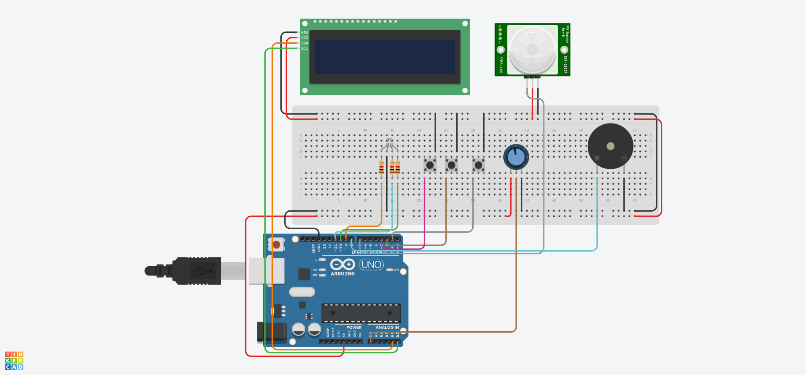

*[Leia em Portugues](README.md)*

# Smart Biometric Alarm Clock

This project implements a prototype for a smart alarm clock using the Arduino platform. The system requires the user to prove they are awake through a "biometric challenge," simulated by reading heart rate data, in addition to detecting physical presence before deactivating the alarm.

## Architecture and Control Logic

The software is structured using a Finite State Machine (FSM) controlled by the `enum Estado` variable, ensuring the microcontroller only executes routines relevant to the current phase of the process:

* **ESPERA (Standby):** Initial state. The system waits for configuration input or the alarm trigger.
* **CONFIGURACAO (Configuration):** Accessed via the Select button. Allows the user to adjust the minimum Beats Per Minute (BPM) threshold required to turn off the alarm (between 50 and 120 BPM). The RGB LED turns Blue.
* **ALARME TOCANDO (Alarm Ringing):** Triggers the intermittent buzzer sound and turns the LED Red. The system only advances if the motion sensor (PIR) detects presence.
* **DESAFIO BIOMETRICO (Biometric Challenge):** The user has a 10-second timeout to perform the heart rate measurement (simulated via potentiometer). If the reading meets or exceeds the configured threshold and the Select button is pressed, the alarm is deactivated. Otherwise, the system returns to the alert state. The LED turns Orange.
* **DESLIGADO (Turned Off):** The alarm is successfully validated and terminated. The LED turns Green, and a confirmation melody is played.

## Pinout and Connections

| Component | Arduino Pin | Configuration | Description |
| :--- | :---: | :---: | :--- |
| **Select Button** | `Pin 1 (TX)` | INPUT_PULLUP | Confirms actions and accesses the menu (*Note: Using the TX pin requires Serial communication to be disabled*) |
| **Up Button** | `Pin 2` | INPUT_PULLUP | Increments variables and simulates the alarm trigger |
| **Down Button** | `Pin 3` | INPUT_PULLUP | Decrements the configured BPM threshold |
| **PIR Sensor** | `Pin 7` | INPUT | Detects user movement |
| **Buzzer** | `Pin 8` | OUTPUT | Emits beeps and melodies |
| **RGB LED (Red)** | `Pin 9` | OUTPUT | PWM control for the red channel |
| **RGB LED (Green)** | `Pin 10` | OUTPUT | PWM control for the green channel |
| **RGB LED (Blue)** | `Pin 11` | OUTPUT | PWM control for the blue channel |
| **HR Sensor (Potentiometer)**| `A0` | ANALOG IN | Simulates the analog reading of a heart rate sensor |
| **I2C LCD (SDA/SCL)** | `A4 / A5` | I2C | Communication with the 16x2 LCD display |

## Circuit Schematic

Below is the component layout and wiring designed on the Tinkercad platform:

